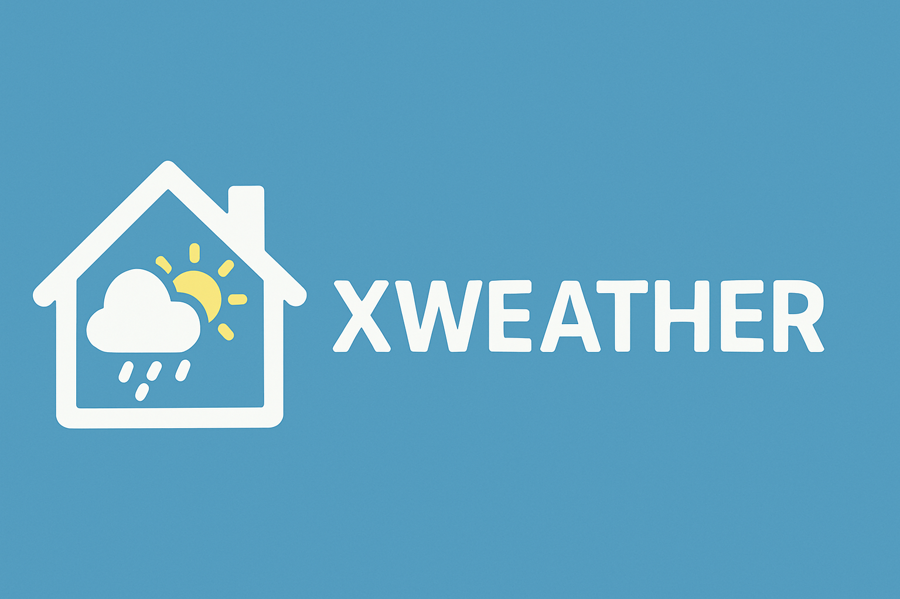

# Xweather Home Assistant Integration 

  

**Xweather** is a custom integration for [Home Assistant](https://www.home-assistant.io/) that provides detailed weather, forecast, and air quality data from [Xweather.com](https://xweather.com/). The service is highly regarded for its accuracy, consistently receiving high rankings from [Forecast Advisor](https://forecastadvisor.com).

***

### Features

This integration provides a comprehensive set of entities for your smart home:

- **Weather Entity**: A single `weather.Xweather` entity that:
  - Shows current conditions including temperature, humidity, pressure, wind speed, and visibility
  - Shows a 7-day daily forecast and hourly forecast with 24 hours of data
  - Is suitable for use on dashboards
- **Individual Sensors**: Separate sensors are created for key data points, including:
  - Temperature, humidity, wind speed, and "feels-like" temperature
  - Cloud coverage, UV index, visibility, and precipitation
  - Specific daily forecast data for **today** and **tomorrow**
- **Air Quality**:
  - A primary `air_quality` entity showing the Air Quality Index (AQI)
  - Separate pollutant sensors for PM2.5, PM10, O3, CO, NO2, and SO2
- **Additional Functionality**:
  - A **Refresh** button on the device page for immediate data updates.
  - Full support for Home Assistant's unit system (metric or imperial).
  - All sensors, including condition, forecast, and AQI, update with each update interval.
  - All entities are grouped under a single **Xweather device**, making them easy to find.

***

### Requirements

To use this integration, you'll need an API key and secret from [xweather.com](https://xweather.com/).

- **Free Access**: You may be eligible for a free API key if you own a personal weather station (PWS) and sign up for the [Contributor Plan](https://signup.xweather.com/pws-contributor).
- **PWS Upload**: If your personal weather station doesn't automatically upload data to PWSWeather, you can use the [PWS Weather Station Upload](https://community.home-assistant.io/t/pws-weather-station-upload/806415) Home Assistant Blueprint to send your sensor data to the service. 

***

### Installation

#### HACS (Recommended)

1. Go to HACS and add this repository as a **Custom Repository**: [https://github.com/tbclark3/homeassistant-xweather](https://github.com/tbclark3/homeassistant-xweather)
2. Select the **Integration** category.
3. Restart Home Assistant when prompted.

#### Manual Installation

1. Copy the `custom_components/xweather` folder into your Home Assistant's `custom_components` directory.
2. Restart Home Assistant.

***

### Configuration

Once the integration is installed, follow these steps:

1. Navigate to **Settings > Devices & Services > Add Integration**.
2. Search for and select **Xweather**.
3. A configuration form will appear where you'll need to enter the following details:
   - **Client ID** (your Xweather API client ID)
   - **Client Secret** (your Xweather API client secret)
   - **Latitude / Longitude** (defaults to your Home Assistant location)
   - **Name**: The base name for your weather and sensor entities (default is `Xweather`)
   - **Update interval**: How often the integration will poll the API in minutes (default is 60). Each update makes four API calls (conditions, air quality, hourly, and daily forecast).  That does not necessarily translate into the number of API calls registered by Xweather because they apply multipliers based on several factors.  As configured by default, this integration makes 4 API calls per hour, but, because of multipliers, that is billed as 12 API calls by Xweather.

***

### Entities and Devices

After configuration, you will find:

- A **Weather entity**: `weather.xweather`
- An **Air Quality entity**: `air_quality.xweather_air_quality`
- **Individual sensors**: e.g., `sensor.xweather_temperature`, `sensor.xweather_humidity`
- A **device page** that groups all these entities and includes a **Refresh** button for manual updates.

All standard Home Assistant condition data are available as attributes on the main weather entity. The `weather.get_forecasts` action can be used to access additional elements from the hourly and daily forecasts.
